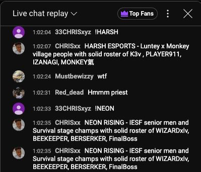
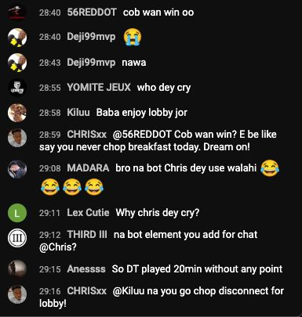

# 🎥 Youtube Intel Bot

A Node.js-powered YouTube Live Chat bot designed for **PUBG Mobile tournament streams**. This bot responds to live chat commands with team rosters from a Google Sheet and generates witty real-time interactions using Gemini AI.

---

## 📦 Features

- 🧠 Responds to commands like `!teamtag` with team info
- 📊 Team rosters sourced from a live Google Sheet
- 🤖 Gemini AI generates real-time, troll-like or helpful replies
- 📺 Fully integrated with YouTube Live Chat API
- 🔒 Keeps credentials secure with `.gitignore`

---

## 🛠️ Setup Instructions

### 1. Clone the Repository

```bash
git clone https://github.com/onyedika19/Youtube-Intel-Bot.git
cd Youtube-Intel-Bot
```

### 2. Install Dependencies

```bash
npm install
```
### 3. Add `credentials.json` Locally

This file contains your **Google OAuth credentials** for accessing the Google Sheets API.

Create a `credentials.json` file in the root directory with the following structure:

```json
{
  "installed": {
    "client_id": "YOUR_CLIENT_ID",
    "project_id": "YOUR_PROJECT_ID",
    "auth_uri": "https://accounts.google.com/o/oauth2/auth",
    "token_uri": "https://oauth2.googleapis.com/token",
    "auth_provider_x509_cert_url": "https://www.googleapis.com/oauth2/v1/certs",
    "client_secret": "YOUR_CLIENT_SECRET",
    "redirect_uris": ["YOUR_REDIRECT_URI"]
  }
}
```

### 4. Configure the Bot

Edit any necessary values in your `.env` file or directly in the code:

- ✅ **Google Spreadsheet ID** – Required to access your team data.
- ✅ **YouTube Live Chat ID** – Needed for the bot to read and respond in chat.
- ✅ **Gemini API Key** – Used to generate AI-based responses.

### 5. Run the Bot

Start the bot with:

```bash
node index.js
```
### 💬 Commands in Chat

```bash
!AE          → Responds with AE’s team info from the Google Sheet  
@BotName     → Responds with an AI-generated chat reply  
```
### 🧪 Example Sheet Format

| Team Tag | Team Name      | Player 1 | Player 2 | Player 3 | Player 4 | Player 5 | Player 6 |
|----------|----------------|----------|----------|----------|----------|----------|----------|
| AE       | Alpha Empire   | John     | Mike     | Sara     | Rex      | Swat     | Neo      |
| BR       | Bravo Rebels   | Lina     | Joy      | Chris    | Kev      | Jun      | Dami     |

## 📸 Live Examples

### 🧾 Team Roster Command Response


> The bot responds instantly with team info when a viewer types `!AE`.

### 🧠 AI-Based Chat Trolling


> Gemini AI analyzes the chat mood and responds with humorous, troll-like messages in real-time.

